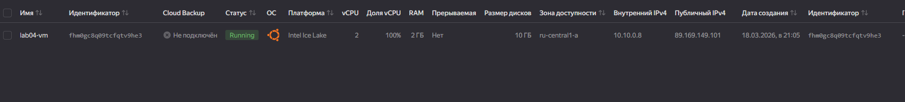
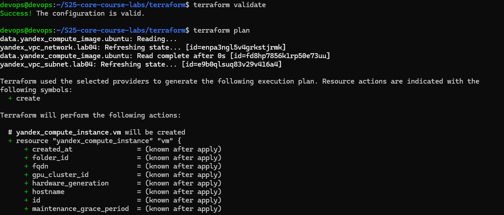
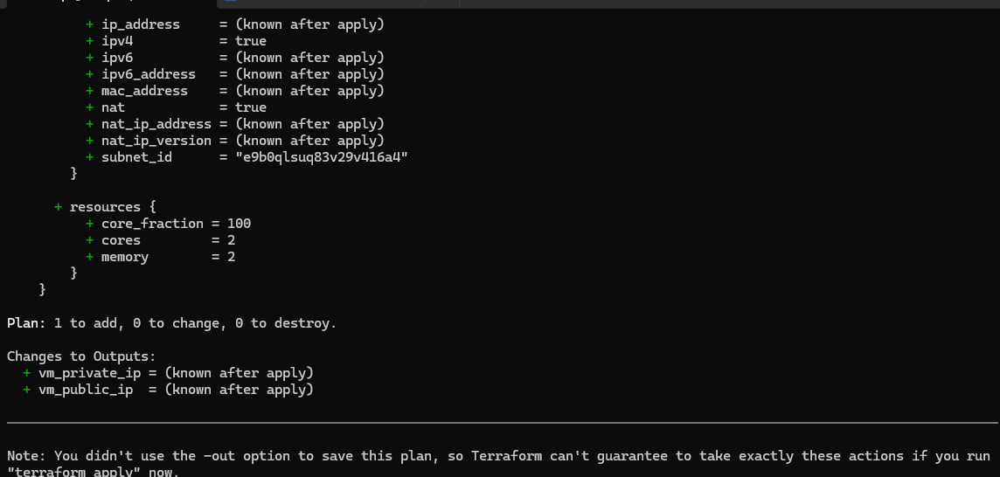
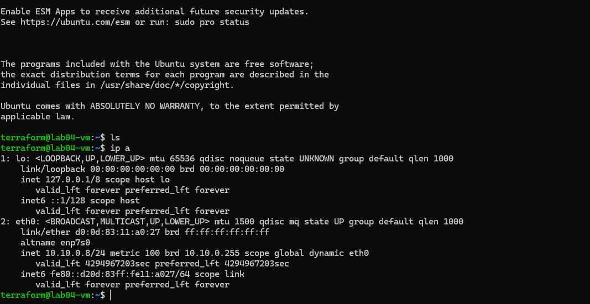
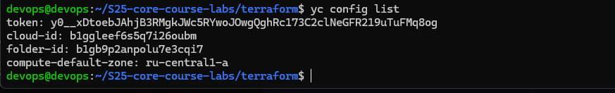
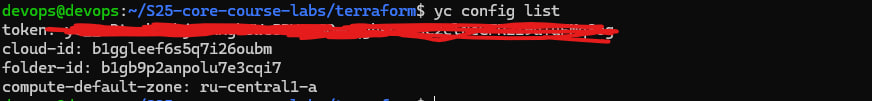

## Overview

In this lab, infrastructure was implemented in Yandex Cloud using Terraform and YC CLI.

The goal was to learn Infrastructure as Code (IaC), automate resource provisioning, and gain hands-on experience with cloud infrastructure.


## 1. Environment Setup

### Tools Installation

The following tools were installed Terraform and YC CLI


### YC CLI Configuration

yc init
yc config list

Configured parameters:

- cloud-id
- folder-id
- zone: ru-central1-a


## 2. SSH Keys

SSH key pair was already generated


## 3. Terraform Configuration

### Provider

```
provider "yandex" {
  service_account_key_file = "authorized_key.json"
  cloud_id                 = var.cloud_id
  folder_id                = var.folder_id
  zone                     = var.zone
}
```

### Network

```
resource "yandex_vpc_network" "lab04" {
  name = "lab04-network"
}
```

### Subnet

```
resource "yandex_vpc_subnet" "lab04" {
  name           = "lab04-subnet"
  zone           = var.zone
  network_id     = yandex_vpc_network.lab04.id
  v4_cidr_blocks = ["10.10.0.0/24"]
}
```


### Compute Instance

```
resource "yandex_compute_instance" "vm" {
  name = "lab04-vm"

  resources {
    cores  = 2
    memory = 2
  }

  boot_disk {
    initialize_params {
      image_id = data.yandex_compute_image.ubuntu.id
      size     = 10
    }
  }

  network_interface {
    subnet_id = yandex_vpc_subnet.lab04.id
    nat       = true
  }

  metadata = {
    ssh-keys = "ubuntu:${file("~/.ssh/id_ed25519.pub")}"
  }
}
```


### Image Data Source

```
data "yandex_compute_image" "ubuntu" {
  family = "ubuntu-2204-lts"
}
```


### Variables

```
variable "cloud_id" {}
variable "folder_id" {}
variable "zone" {
  default = "ru-central1-a"
}
```

## 4. Terraform Workflow

Initialization:

`terraform init`

Formatting:

`terraform fmt`

Validation:

`terraform validate`

Execution plan:

`terraform plan`

Apply terraform:

`terraform apply`


## 5. Virtual Machine

A virtual machine was successfully created in Yandex Cloud.

Public IP address:

`89.169.149.101`


## 6. SSH Access

Connection to the VM:

`ssh terraform@89.169.149.101`


## 7. Results

During this lab:

- Infrastructure as Code approach was implemented
- Terraform provider for Yandex Cloud was configured
- The following resources were created:
  - VPC network
  - Subnet
  - Virtual machine
- SSH access to the VM was configured
- Practical experience with Terraform and YC CLI was obtained


## Conclusion

Terraform enables declarative infrastructure management and reproducible deployments in cloud environments. Using IaC significantly improves consistency, automation, and maintainability of infrastructure.

## Screenshots












