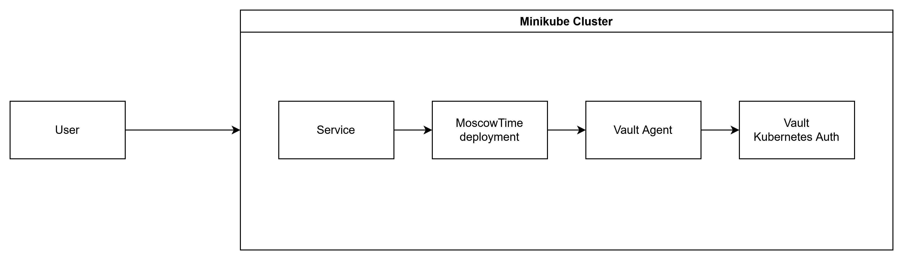
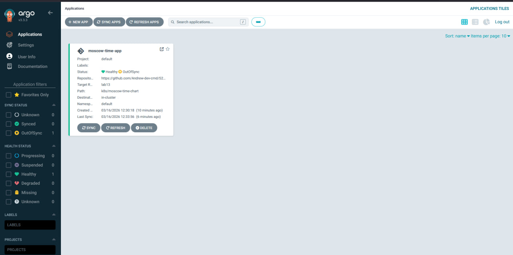
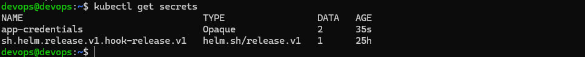
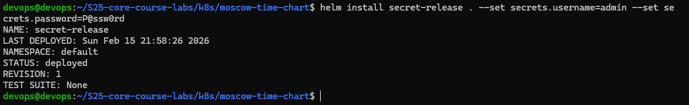
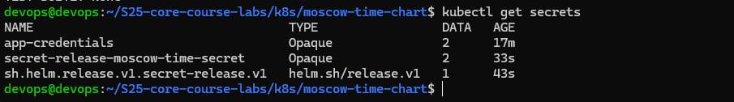
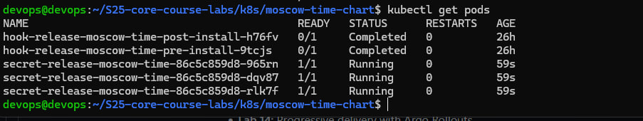
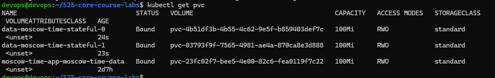
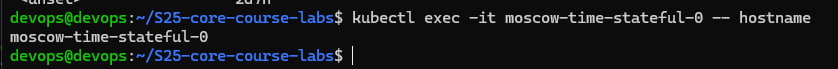
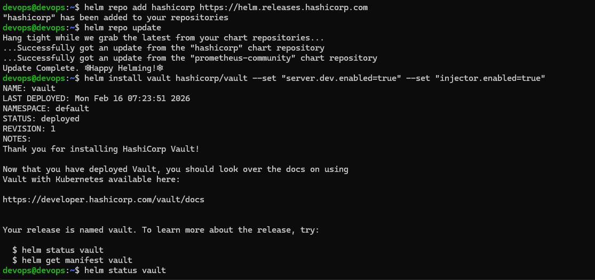
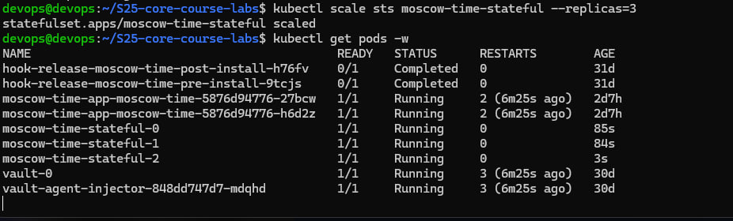

# Lab 11 — Kubernetes Secrets & HashiCorp Vault

## 📌 Overview

This lab demonstrates secure secret management in Kubernetes using:

- Native Kubernetes Secrets
- Helm-based secret templating
- HashiCorp Vault (KV v2)
- Kubernetes Authentication
- Vault Agent Sidecar Injection pattern

Environment:
- Minikube
- Helm
- HashiCorp Vault (dev mode)

---

# 🏗 Architecture



## 🔐 Task 1 — Kubernetes Secrets Fundamentals

> Important! Before using this method check Helm and k8s official documentation. Base64 is not encryption, only encoding.

Creating Secret

```bash
kubectl create secret generic app-credentials --from-literal=username=admin --from-literal=password=P@ssw0rd
```

Check Secret

```bash
kubectl get secret app-credentials -o yaml
```

Example output:

```bash
data:
  username: YWRtaW4=
  password: UEBzc3cwcmQ=
```

Decoding:

```bash
echo "YWRtaW4=" | base64 -d
admin
```

> *Important!* If a user has read permissions for the underlying YAML files, they will be able to view the plaintext values of these secrets, as Helm does not natively encrypt secret data.

### 🔎 Encoding vs Encryption

- Kubernetes Secrets are base64 encoded
- Base64 != encryption
- Anyone with API access can decode them

You can enable encryption by configuring etcd encryption at rest.

production Enable etcd encryption, use RBAC, limit secret access, and consider an external secret manager like Vault.

## ⚙ Task 2 — Helm Managed Secrets

secrets.yaml

```yaml
apiVersion: v1
kind: Secret
metadata:
  name: {{ include "moscow-time.fullname" . }}-secret
  labels:
    {{- include "moscow-time.labels" . | nindent 4 }}
type: Opaque
stringData:
  username: {{ .Values.secrets.username | quote }}
  password: {{ .Values.secrets.password | quote }}
```

values.yaml

```yaml
secrets:
  username: "no-commit"
  password: "no-commit"
```

> Important! No commit your secrets.

Add into Deployment

```yaml
envFrom:
  - secretRef:
      name: {{ include "moscow-time.fullname" . }}-secret
```

Verifying

```bash
kubectl exec -it secret-release-moscow-time-55bddfb458-fcp4b -- env | grep USER
```

```bash
kubectl describe pod
```

> Secrets must be in the container enviroment, but not visible in pod desribing.

### Resource limiting

```yaml
resources:
  limits:
    cpu: 250m
    memory: 256Mi
  requests:
    cpu: 100m
    memory: 128Mi
```

## 🔐 Task 3 — HashiCorp Vault Integration

## Installing Vault

```bash
helm repo add hashicorp https://helm.releases.hashicorp.com
helm repo update

helm install vault hashicorp/vault --set "server.dev.enabled=true" --set "injector.enabled=true"
```

It spawn:

```bash
vault-0                                       1/1     Running     0          72s
vault-agent-injector-848dd747d7-mdqhd         1/1     Running     0          72s
```

### KV v2

In dev mode KV v2 enabled by default.

Creating secrets

```bash
vault kv put secret/myapp/config username="vaultadmin" password="P@ssw0rd"
```

### Enable Kubernetes Auth

```bash
vault auth enable kubernetes
```

Configuring

```bash
vault write auth/kubernetes/config kubernetes_host="https://kubernetes.default.svc:443"
```

### Configuring Policy

```bash
path "secret/data/myapp/*" {
  capabilities = ["read"]
}
```

## 🚀 Vault Agent Injection

### Add deployment annotations

```bash
annotations:
  vault.hashicorp.com/agent-inject: "true"
  vault.hashicorp.com/role: "myapp-role"
  vault.hashicorp.com/agent-inject-secret-config: "secret/data/myapp/config"
```

Check

```bash
kubectl exec -it secret-release-moscow-time-55bddfb458-fcp4b -- ls /vault/secrets
```

> Vault Agent uses the ServiceAccount JWT to authenticate via Kubernetes Auth, after which the secret is injected into the pod as a file.

## 🔎 Security Analysis

| Feature            | Kubernetes Secret | Vault     |
| ------------------ | ----------------- | --------- |
| Encryption at rest | Optional          | Yes       |
| Access control     | RBAC              | Policies  |
| Dynamic secrets    | No                | Yes       |
| Rotation           | Manual            | Automatic |
| Audit logging      | Limited           | Built-in  |

The applicability of standard Kubernetes Secrets is limited to test environments: they offer only optional encryption and manual data lifecycle management. Vault, on the other hand, provides comprehensive production-grade security, including strict access policies, automatic secret rotation, and built-in audit logging of all actions, which is essential for supporting SOC operations and security control.

## Screenshots

















