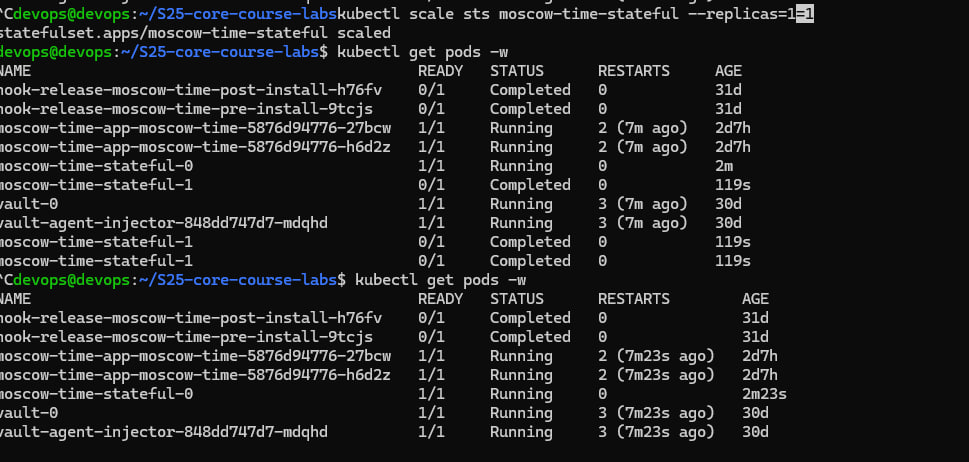

## 1. Overview

In this lab, Kubernetes StatefulSets were used to deploy a stateful application with stable identities and persistent storage.

Unlike Deployments, StatefulSets provide:

- Stable pod naming
- Stable network identity
- Persistent storage per pod
- Ordered deployment and scaling

---

## 2. Headless Service

A headless service was created to enable stable DNS resolution for pods.

Configuration:

    apiVersion: v1
    kind: Service
    metadata:
      name: moscow-time-headless
    spec:
      clusterIP: None
      selector:
        app: moscow-time-stateful
      ports:
        - port: 5000
          targetPort: 5000

Key point:
- `clusterIP: None` enables direct pod DNS resolution

---

## 3. StatefulSet Deployment

StatefulSet was deployed with volumeClaimTemplates to provide persistent storage.

Configuration:

    apiVersion: apps/v1
    kind: StatefulSet
    metadata:
      name: moscow-time-stateful
    spec:
      serviceName: moscow-time-headless
      replicas: 2
      selector:
        matchLabels:
          app: moscow-time-stateful
      template:
        metadata:
          labels:
            app: moscow-time-stateful
        spec:
          containers:
            - name: app
              image: enot0704/moscow-time-app:v1.0
              ports:
                - containerPort: 5000
              volumeMounts:
                - name: data
                  mountPath: /data
      volumeClaimTemplates:
        - metadata:
            name: data
          spec:
            accessModes: ["ReadWriteOnce"]
            resources:
              requests:
                storage: 100Mi

---

## 4. Verification

### Pods

    kubectl get pods

Pods have stable ordinal naming.

---

### Persistent Volumes

    kubectl get pvc

Each pod has its own dedicated volume.

---

## 5. Stable Network Identity

Each pod has a stable hostname and DNS entry.

Commands:

    kubectl exec -it moscow-time-stateful-0 -- hostname
    kubectl exec -it moscow-time-stateful-1 -- hostname

DNS resolution:

    kubectl exec -it moscow-time-stateful-0 -- nslookup moscow-time-stateful-1.moscow-time-headless

---

## 6. Ordered Deployment and Scaling

StatefulSet ensures ordered startup and termination.

### Scale up

    kubectl scale sts moscow-time-stateful --replicas=3
    kubectl get pods -w

Observed behavior:
- Pods start in order: 0 → 1 → 2

### Scale down

    kubectl scale sts moscow-time-stateful --replicas=1
    kubectl get pods -w

Observed behavior:
- Pods terminate in reverse order: 2 → 1 → 0

---

## 7. Key Differences: Deployment vs StatefulSet

| Feature            | Deployment | StatefulSet |
|--------------------|-----------|-------------|
| Pod identity       | Dynamic   | Stable      |
| DNS                | No        | Yes         |
| Storage            | Shared    | Per-pod     |
| Scaling order      | Random    | Ordered     |

---

## 8. Conclusion

In this lab:

- StatefulSet was successfully deployed
- Headless service enabled stable DNS resolution
- Each pod received its own persistent storage
- Ordered scaling behavior was verified

StatefulSets are essential for applications that require stable identity and persistent storage, such as databases and distributed systems.

## 9. Conclusion

