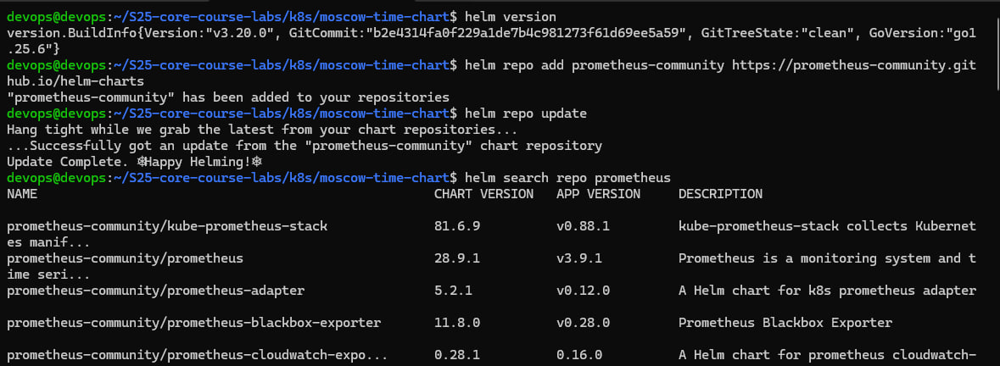
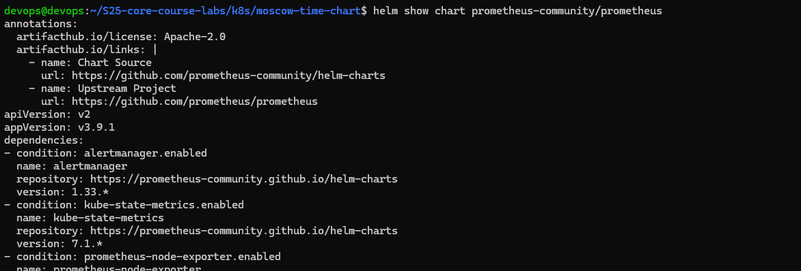
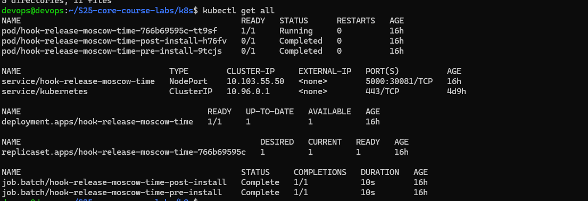
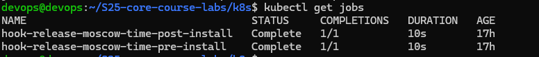

# Moscow Time App — Kubernetes & Helm Deployment

## 📌 Project Overview

This project demonstrates deployment of a Python application showing Moscow time using:

- Kubernetes
- Helm
- Minikube
- Multi-environment configuration
- Helm Hooks

---

## 🏗 Architecture

Application is deployed using:

- Deployment
- Service (NodePort)
- Liveness & Readiness probes
- Helm templating
- Environment-based values files
- Helm hooks (pre-install & post-install)

---

## 📂 Project Structure

```bash
.
├── deployment.yml
├── moscow-time-chart
│   ├── charts
│   ├── Chart.yaml
│   ├── templates
│   │   ├── deployment.yaml
│   │   ├── _helpers.tpl
│   │   ├── hooks
│   │   │   ├── post-install-job.yaml
│   │   │   └── pre-install-job.yaml
│   │   └── service.yaml
│   ├── values-dev.yaml
│   ├── values-prod.yaml
│   └── values.yaml
└── service.yml
```

---

## 🏗 Kubernetes Deployment (without Helm)

Basic deployment:

```bash
kubectl apply -f deployment.yml
kubectl apply -f service.yml
```

Check:

```bash
kubectl get pods
kubectl get svc
```

## 🚀 Helm Deployment

Start Minikube:

```bash
minikube start
```

Install Helm chart (dev):

```bash
helm install dev-release ./moscow-time-chart -f ./moscow-time-chart/values-dev.yaml
```

Check resources:

```bash
kubectl get pods
kubectl get svc
```

Open service:

```bash
minikube service dev-release-moscow-time
```

## 🌍 Multi-Environment Configuration

### Development

- 1 replica
- Reduced CPU and memory limits
- NodePort 30081

### Production

- 3 replicas
- Increased CPU and memory limits
- NodePort 30082

### Upgrading

```bash
helm upgrade dev-release ./moscow-time-chart -f ./moscow-time-chart/values-prod.yaml
```

## 🔁 Helm Hooks

Two hooks are implemented:

Pre-install Hook

- Runs before installation
- Executes validation job
- Uses hook-weight
- Automatically deleted after success

Post-install Hook

- Runs after installation
- Executes smoke test job
- Automatically deleted after success
- Hooks are implemented using Kubernetes Job resource.

## ❤️ Health Checks

Application includes:

- Liveness Probe
- Readiness Probe

Ensuring proper container lifecycle management.

## 🛠 Technologies Used

- Kubernetes
- Helm
- Minikube
- Docker
- Python

## 📊 Screenshots







